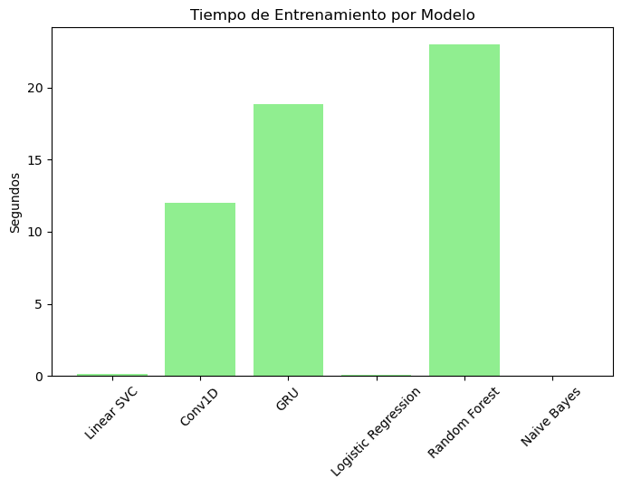

# Análisis de Sentimiento en Reseñas de Amazon  
 


## Descripción del Proyecto
Este proyecto implementa un **modelo de análisis de sentimiento** sobre reseñas de productos de Amazon 
para clasificar automáticamente opiniones en **Positivas** o **Negativas**.  
El análisis de sentimiento es una herramienta clave para empresas de e-commerce, 
permitiendo identificar rápidamente la percepción del cliente, mejorar la experiencia de usuario 
y detectar áreas de mejora en productos y servicios.

## Dataset
- **Fuente oficial:** [Amazon Review Data (2018)](https://nijianmo.github.io/amazon/index.html)
- **Archivo utilizado:** `Industrial_and_Scientific_5.json.gz`
- **Procesamiento realizado:**
  - Eliminación de reseñas neutrales (rating = 3).
  - Conversión a clasificación binaria: **1 = Positivo** y **0 = Negativo**.

## Pipeline del Proyecto
1. **Preprocesamiento de texto:** limpieza de caracteres especiales, tokenización, lematización y eliminación de stopwords.  
2. **EDA (Análisis Exploratorio):** visualización de longitud de reseñas y nube de palabras.  
3. **Modelos de Machine Learning (TF-IDF):**
   - Logistic Regression  
   - Naive Bayes  
   - Random Forest  
   - Linear SVC  
4. **Modelos de Deep Learning:**
   - GRU (Red recurrente)  
   - Conv1D (Red convolucional)  
5. **Comparación de resultados:** métricas de **Accuracy, F1-score y tiempo de entrenamiento**.

## Resultados Principales
- **Modelo recomendado:** `Linear SVC`  
- **Métricas obtenidas:**
  - Accuracy: **0.9588**
  - F1-score: **0.9783**
  - Tiempo de entrenamiento: **0.16 s**

### Visualizaciones de Resultados
  
  


*(Las imágenes se generan automáticamente al ejecutar el notebook y se guardan en la carpeta `images/`.)*

## Tecnologías Utilizadas
- Python 3.8+
- Pandas, NumPy, Matplotlib
- Scikit-learn
- TensorFlow / Keras
- HuggingFace Transformers
- NLTK, WordCloud

## Cómo Ejecutar el Notebook
1. Clonar el repositorio:
   ```bash
   git clone https://github.com/ceciagro/amazon-sentiment-analysis.git
   cd amazon-sentiment-analysis

